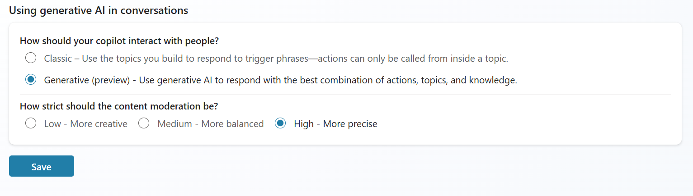

# Lab 07: Use generative orchestration to interact with your connectors

Prerequisites

Labs have been designed to be completed with only a Microsoft Copilot Studio trial. You can start most labs without having to complete the previous module but note that some exercises may reference previous labs. To fully experience the features and functionality of the product, it is recommended that you make sure to have completed all pre-requisites below before starting this lab.

For this lab you need:

A computer with internet access.

Be able to log into the provided Microsoft tenant (some companies enforce users to only connect to their company tenant) or your own enterprise tenant with a Copilot Studio User License (or trial)

Generative AI should be set to “Generative” (in Settings, Generative AI)

Generative orchestration

By default, a agent responds to users by triggering the topic whose trigger phrases match most closely the user's query, and it fills topic inputs from the conversation context. You can configure your agent to use generative AI to choose not only from topics you created, but also from actions you added to extend the copilot.

In generative mode, a agent can fill topic inputs, not only from the conversation context but also by generating questions to prompt the user for values. To learn more about this behavior and how to manage it, see Manage topic inputs and outputs.

Using generative AI to determine how your agent responds can make the conversation more natural and fluid for the users. When a user sends a message, your agent selects one or more actions or topics to prepare its response. Multiple factors determine the selection. The most important factor is the description of the topics and actions. Other factors include the name of a topic or actions, any input or output parameters, and their names and descriptions. Descriptions make it possible for your agent to be more accurate when it associates a user's intent with actions and topics.

In generative mode, a agent can select multiple actions or topics at once, to handle multi-intent queries. Once actions and topics are selected, the agent generates a plan that determines their execution order.

When you test a agent that uses generative mode in Copilot Studio, you can open the conversation map to follow the execution of the plan.

Task 1: Enable generative orchestration

Go to Settings and to the Generative AI options

In How should your agent decide how to respond? select Generative, then Save

Actions

When you turn on generative mode, your agent can automatically select the most appropriate action or topic, to respond to a user at runtime. In classic mode, a agent can only use topics to respond to the user. However, you can still design your agent to call actions explicitly from within topics.

Actions are based on one of the following core action types:

Prebuilt connector action

Custom connector action

Power Automate cloud flow

AI Builder prompts

Bot Framework skill

Each core action has additional information that describes its purpose, allowing the agent to use generative AI to generate questions. These questions are required to fill the inputs needed to perform the action. Therefore, you don't need to manually author question nodes to gather all inputs needed, such as the inputs on a flow. Inputs are handled for you during runtime.

Actions can generate a contextual response to a user's query, using the results of the action. Alternatively, you can explicitly author a response for the action.

Task 1: Create an action

From the navigation, go to the Actions tab

Select Add an action.

Select the Get forecast for today connector.

Wait for the connection to get automatically created.

Scroll down, in End user authentication, choose Copilot author authentication. That way, the agent can work without using the end-user connection when using the weather connector. Instead, the connection the maker has setup will be used. Leave other properties from that screen as is.

Select Next.

Select Edit inputs.

Leave the Location one as is, but for Units, choose Set as a value, in How will the agent fill this input?

Choose the I value (Imperial)

Save, and then select Next.

Review the configuration and select Finish.

Task 2: Test your action

Go to the Test pane.

Ask a question

In the Test pane, click on the Conversation map to see how the agent interprets questions and prompts for answers.

Answer with a city

See the agent automatically updates the inputs with the city and provides an answer.

Tell the bot you made a mistake and change your query.

See how the agent updates its query to the connector and see how it also reacts to the instructions to list all information available to it.

Summary

Thank you for completing the lab ‘Use generative AI orchestration to interact with your connectors. You have successfully:

Created an action in Copilot Studio

Displayed dynamic data back to the user in Copilot Studio

Leveraged conversational context to ask follow-up questions

Terms of Use

By using this document, in whole or in part, you agree to the following terms:

Notice

Information and views expressed in this document, including (without limitation) URL and other Internet Web site references, may change without notice. Examples depicted herein, if any, are provided for illustration only and are fictitious. No real association or connection is intended or should be inferred. This document does not provide you with any legal rights to any intellectual property in any Microsoft product.

Use Limitations

Copying or reproduction, in whole or in part, of this document to any other server or location for further reproduction or redistribution is expressly prohibited. Microsoft provides you with this document for purposes of obtaining your suggestions, comments, input, ideas, or know-how, in any form, ("Feedback") and to provide you with a learning experience. You may use this document only to evaluate its content and provide feedback to Microsoft. You may not use this document for any other purpose. You may not modify, copy, distribute, transmit, display, perform, reproduce, publish, license, create derivative works from, transfer, or sell this document or any portion thereof. You may copy and use this document for your internal, reference purposes only.

Feedback

If you give Microsoft any Feedback about this document or the subject matter herein (including, without limitation, any technology, features, functionality, and/or concepts), you give to Microsoft, without charge, the right to use, share, and freely commercialize Feedback in any way and for any purpose. You also give third parties, without charge, the right to use, or interface with, any Microsoft products or services that include the Feedback. You represent and warrant that you own or otherwise control all rights to such Feedback and that no such Feedback is subject to any third-party rights.

DISCLAIMERS

CERTAIN SOFTWARE, TECHNOLOGY, PRODUCTS, FEATURES, AND FUNCTIONALITY (COLLECTIVELY "CONCEPTS"),

INCLUDING POTENTIAL NEW CONCEPTS, REFERENCED IN THIS DOCUMENT ARE IN A SIMULATED ENVIRONMENT

WITHOUT COMPLEX SET-UP OR INSTALLATION AND ARE INTENDED FOR FEEDBACK AND TRAINING PURPOSES

ONLY. THE CONCEPTS REPRESENTED IN THIS DOCUMENT MAY NOT REPRESENT FULL FEATURE CONCEPTS AND MAY

NOT WORK THE WAY A FINAL VERSION MAY WORK. MICROSOFT ALSO MAY NOT RELEASE A FINAL VERSION OF SUCH

CONCEPTS. YOUR EXPERIENCE WITH USING SUCH CONCEPTS IN A PHYSICAL ENVIRONMENT MAY ALSO BE DIFFERENT.

THIS DOCUMENT, AND THE CONCEPTS AND TRAINING PROVIDED HEREIN, IS PROVIDED “AS IS”, WITHOUT WARRANTY

OF ANY KIND, WHETHER EXPRESS, IMPLIED, OR STATUTORY, INCLUDING (WITHOUT LIMITATION) THE WARRANTIES OF

MERCHANTABILITY, FITNESS FOR A PARTICULAR PURPOSE, TITLE, AND NONINFRINGEMENT. MICROSOFT DOES NOT

MAKE ANY ASSURANCES OR REPRESENTATIONS WITH REGARD TO THE ACCURACY OF THE RESULTS, THE OUTPUT THAT DERIVES FROM USE OF THIS DOCUMENT OR THE CONCEPTS, OR THE SUITABILITY OF THE CONCEPTS OR INFORMATION CONTAINED IN THIS DOCUMENT FOR ANY PURPOSE.

MICROSOFT COPILOT STUDIO (1) IS NOT INTENDED OR MADE AVAILABLE AS A MEDICAL DEVICE FOR THE

DIAGNOSIS OF DISEASE OR OTHER CONDITIONS, OR IN THE CURE, MITIGATION, TREATMENT OR PREVENTION OF

DISEASE, OR OTHERWISE TO BE USED AS A COMPONENT OF ANY CLINICAL OFFERING OR PRODUCT, AND NO LICENSE

OR RIGHT IS GRANTED TO USE MICROSOFT COPILOT STUDIO FOR SUCH PURPOSES, (2) IS NOT DESIGNED OR

INTENDED TO BE A SUBSTITUTE FOR PROFESSIONAL MEDICAL ADVICE, DIAGNOSIS, TREATMENT, OR JUDGMENT AND SHOULD NOT BE USED AS A SUBSTITUTE FOR, OR TO REPLACE, PROFESSIONAL MEDICAL ADVICE, DIAGNOSIS,

TREATMENT, OR JUDGMENT, AND (3) SHOULD NOT BE USED FOR EMERGENCIES AND DOES NOT SUPPORT EMERGENCY

CALLS. ANY CHATBOT YOU CREATE USING MICROSOFT COPILOT STUDIO IS YOUR OWN PRODUCT OR SERVICE,

SEPARATE AND APART FROM MICROSOFT COPILOT STUDIO. YOU ARE SOLELY RESPONSIBLE FOR THE DESIGN,

DEVELOPMENT, AND IMPLEMENTATION OF YOUR CHATBOT (INCLUDING INCORPORATION OF IT INTO ANY PRODUCT

OR SERVICE INTENDED FOR MEDICAL OR CLINICAL USE) AND FOR EXPLICITLY PROVIDING END USERS WITH

APPROPRIATE WARNINGS AND DISCLAIMERS PERTAINING TO USE OF YOUR CHATBOT. YOU ARE SOLELY RESPONSIBLE

FOR ANY PERSONAL INJURY OR DEATH THAT MAY OCCUR AS A RESULT OF YOUR CHATBOT OR YOUR USE OF

MICROSOFT COPILOT STUDIO IN CONNECTION WITH YOUR CHATBOT, INCLUDING (WITHOUT LIMITATION) ANY SUCH INJURIES TO END USERS.
